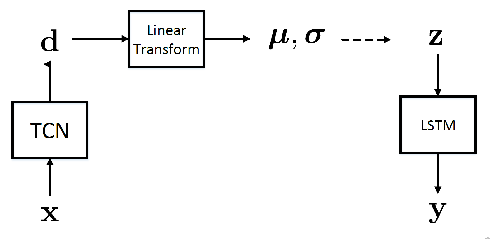
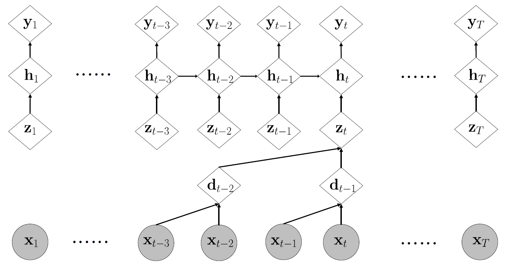

# language-modeling

The goal of language modelling is to maximize the probability of target sentences
by maximizing the probability of the next word at each time steps.
In this repo, we implement TCN、RNN、STCN、CRN、SCRN as our language models.
We use Penn Tree Bank (PTB) as our corpus.

## SCRN
CRN fulfills TCN as encoder and RNN as decoder so that the global semantics as well as the local dependencies are simultaneously learned from sequence data. To facilitate the interpretation and robustness in neural networks, we further develop stochastic modeling for CRN based on variance inference. We call it SCRN. The merits of CNN and RNN are then incorporated in inference of latent space which sufficiently produces a generative model for sequential prediction. Experiments on language model shows the effectiveness of stochastic CRN when compared with other sequential machines.

+ flow chart  

+ architecture 

## Setting
* Hardware:
  * CPU: Intel Core i7-4930K @3.40 GHz
  * RAM: 64 GB DDR3-1600
  * GPU: GeForce GTX 1080ti
* pytorch 
* Dataset
  * Penn Treebank
